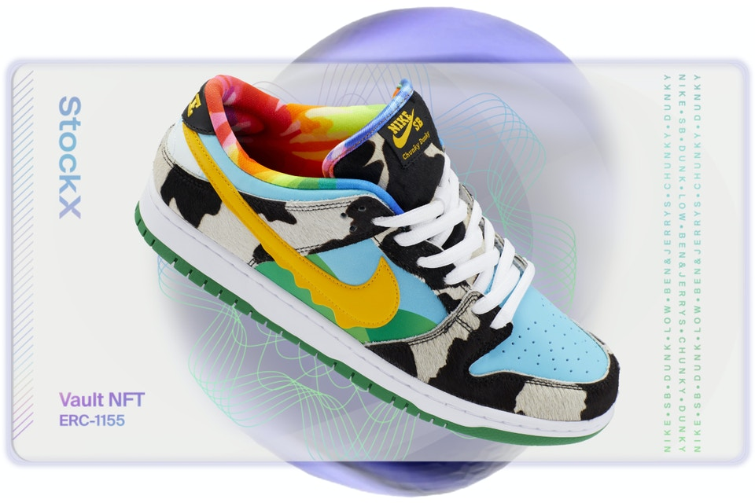

# StockX Vault NFTs - Bridging the Gap Between Digital and Physical Collectibles

### Andrew Altman

---

## Overview of StockX and The Vault

StockX is an online resale marketplace, serving as an auction facilitator and product authenticator between buyers and sellers, primarily in the secondary sneaker market. The Detroit-based company was founded by Dan Gilbert, Josh Luber, Greg Schwartz, and Chris Kaufman in March 2015 and launched in February 2016. StockX has received backing from Gilbert, investment companies Battery Ventures and GV, and individual investments from from the likes of Scooter Braun, Eminem, Mark WAhlberg, Steve Aoki, and Marc Benioff. The company raised $6 million in February 2017 and then an additional $44 million in a second venture round in September 2018. In another venture round in June 2019, StockX raised $110 million and was valued at $1 billion. In addition to Battery Ventures and GV, investors now included General Atlantic, GGV Capital, and DST Global. By April of 2021, the company said it was valued at $3.8 billion after a secondary tender offering. 

On January 18, StockX CEO Scott Cutler announced the launch of Vault NFTs − NFTs minted by StockX under custodial authority as ERC-1155 on the Etherium blockchain that are attached to their physical sneaker counterpart. The sneakers, and other coveted items StockX says can be may soon be linked to Vault NFTs, are stored in the company's own secure, climate-controlled facility and can be taken posession of at any time. This custom depot for "sneakerhead" entrepreneurs and enthusiasts together with their catalog of digital assets are known collectively as The Vault. StockX also says that Vault NFT holders will have exclusive access to events and offerings on the site. Alongside this exciting announcement, they recently recruited the help of Goldman Sachs and Morgan Stanley ahead of a highly anticipated IPO − expected sometime in the first half of 2022 − which should bring with it a substantial (and tangible) collectibles business to market. 

## Business Activities

When a buyer purchases a Vault NFT, they are buying the corresponding sneaker minted on the token. The actual sneaker is stored in The Vault, saving the buyer closet space, as well as the time and resources required to receive the product and flip it, should that be their aim, which they can do as easily as selling the NFT. This dramatically reduces transaction costs for both parties as well as the environmental impact of the entire marketplace. 

The novelty of Vault NFTs is the significant efficiency they add to an already robust resale market of sneakers, which are themselves already a highly collectible commodity. Sneakers and NFTs make a logical pairing. And while NFTs may be difficult to categorize and value, Cowen Equity Research classified sneakers as an emerging alternative asset class in 2019. So while the intention of this marriage is for NFTs to add efficiency to the resale market, an unintended effect may be that sneakers may in fact lend legitimacy to NFTs. Sneakers are a familiar commodity with a growing capitalization and historical price data for reference (which StockX provides on their website). All of this can add viability to a token market that has been quickly flooded by artistic hopefuls and get-rich-quickers and that has been clouded by fickle meme stock-type investors. Also, StockX has an advantage in bringing this tech to their platform as the market maker for a $6 billion resale market that is predicted to balloon to $30 billion by 2030. However, there is competition for the dollars (and soon cryptocurrency) of digital fashion investors and collectors.

## Landscape

Digital fashion is an industry that has been expanding rapidly as the metaverse takes shape. In December, Nike announced it purchased RTFKT (pronounced "artifact"), a startup leader in digital streetwear and sneakers as downloadable content for gaming and as NFTs. RTFKT has shown there is impressive demand for their unique add-ons in online gaming − now Nike is banking these collectibles will translate analogously to real world streetwear culture, with digital sneaker NFTs being bought up in order to "flex" on people in the metaverse. Several other major players in apparel have made the jump to digital fashion. Ralph Lauren recently launched a digital line of retro winter sportswear from their 1990's collection in the Roblox online universe. in December, Gucci launched an immersive experience in Florence where Florentines can interact with ambitious works of Creative Director Alessandro Michele, and others can access the experience through the virtual Gucci Garden experience in Roblox. Last year Balenciaga released its Fall 2021 collection via a custom video game and collaborated with Fortnite on a line of digital clothing for players. And now that Ye (formerly Kanye West) and Demna Gvasalia have collaborated with Gap on a project called Yeezy Gap Engineered by Balenciaga, speculators imagine the retail giant will make a push in the metaverse. 

All of these digital fashion experiences and collectibles sound fun, and likely very lucrative for the early companies who stake their claim in the metaverse and evolve their products with user trends. But at the end of the day, they still only seem like collectibles with largely the same utility as buying clothes for your own use in the real world. A large percentage of users will likely engage with digital fashion, other digital collectibles, and the metaverse entirely as consumers. But there are more and more people every day willing to do the reserch and leverage these new tools to build their digital portfolios while also taking part in the fun of collectibles and fast evolving pace of digital culture. Vault NFTs may bridge the gap by providing consumers and investors with both a digital and physical asset. These assets offer an opportunity to invest in a real piece of physical culture that can be more easily valued thanks to an exising market, and which, in theory, can actually be worn − not that you would risk creasing them.
> "We’re excited about our digital future − a future where NFTs can be bought and sold across multiple platforms and paid for with cryptocurrency; a future harnessed by new NFT products that empower the creator economy; and a future where web3 unlocks marketplace efficiencies and new experiences for our global community. Our digital future will enable an ever expanding opportunity to trade and consume current culture." −Scott Cutler, CEO StockX

> Vault NFT for the Nike SB Dunk Low Ben & Jerry's Chunky Dunky (StockX)

## Recommendations

Currently, StockX is slow relaeasing their Vault NFTs for a limited selection of products that the company currently has in stock. However, since its inception, their business model has been to receive products from sellers and authenticate them before sending them off to buyers. They charged pretty high fees to provide this service and their NFTs are marketed as significantly reducing these costs for both buyer and seller. It seems like there is an opportunity here for StockX to further link the way their users are accostomed to interacting with them with the draw of digitizing their assets. They could release a list of some of the most desirable sneakers and, for a fee, give owners of those products an opportunity to have them stored in the StockX facility and mint an NFT for the owner to hold or sell the same way they would if purchased through the Vault directly. This could prove a powerful way for StockX to use blockchain technology to incentivize users to turnover valuable inventory to their storage facility in exchange for a token. Owners are better happy that their item is stored in a secure location and has increased resale value and StockX makes more in fees with less labor and more user engagement. Overall, Vault NFTs are a clever way to link two alternative investments. StockX was in a unique position to make this linkage because sneaker prices on the secondary market already fluctuated greatly based on supply and demand. NFTs move in much the same way whereas retailers cannot sell with such price volatility, so it will be interesting to see how their competitors respond. It will be interesting to see what they do in the next year and whether you consider yourself a sneakerhead or not, this hybrid asset category is a good reason to keep your eye on StockX.

---

### Sources

- [StockX Vault NFTs](https://stockx.com/lp/nfts/?source=mobile)
- [StockX Vault NFT Launch](https://stockx.com/about/stockx-launches-vault-nfts/)
- [Wikipedia - StockX](https://en.wikipedia.org/wiki/StockX)
- [Business Insider - Vault NFTs](https://markets.businessinsider.com/news/stocks/vault-nfts-launches-digital-sneakers-ahead-of-highly-anticipated-stockx-ipo-1031114207)
- [Yahoo! - Global Sneaker Resale Market](https://news.yahoo.com/global-sneaker-resale-market-could-reach-30-billion-by-2030-cowen-191003371.html)
- [Statista - StockX Statistics](https://www.statista.com/chart/24313/stockx-gross-merchandise-volume/#:~:text=Over%20the%20past%20few%20years,billion%20sneaker%20market%20by%202025.)
- [Forbes - Yeezy Gap Engineered by Balenciaga](https://www.forbes.com/sites/pamdanziger/2022/01/10/theres-a-new-face-of-luxury-as-balenciaga-and-kanye-west-collaborate-for-yeezy-gap/?sh=2612427b4a6a)
